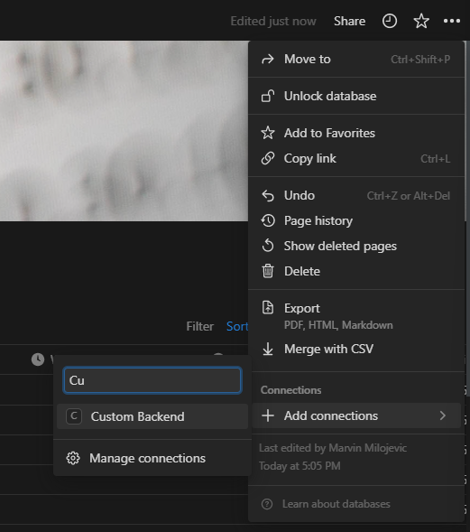

# NotionBackend
## Search for new Databases to embed:
At first enable Custom Backend on Database:


Python Code:
```
from notion_client import Client
notion = Client(auth="<TOKEN>")
notion.search(
  query = "<DATABASE_TITLE>"
  filter = {
    "value": "database",
    "property": "object"
  }
)
```